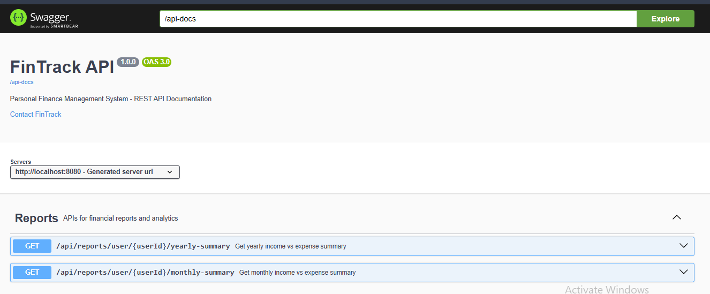
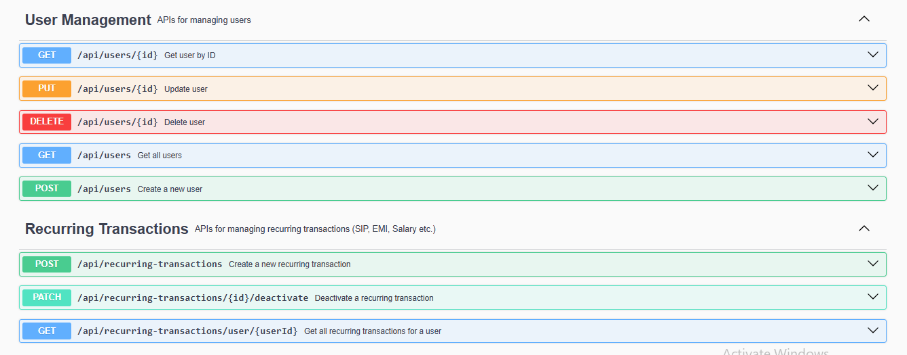
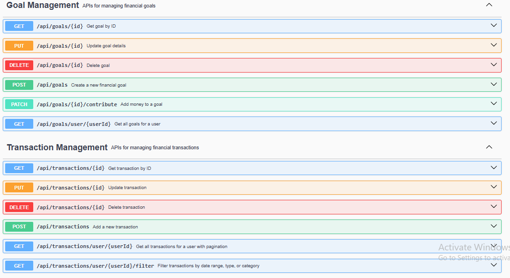
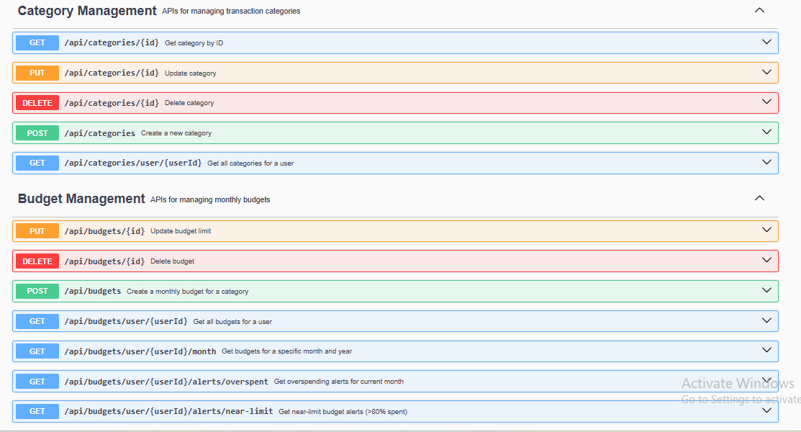

# 💰 FinTrack — Personal Finance Management System

<div align="center">


### Production-Ready Personal Finance Management REST API

Built with **Spring Boot 3.3**, **Java 21**, **MySQL**, and modern backend development best practices.

</div>

---

## 🚀 Highlights

* ✅ Layered Architecture (Controller → Service → Repository)
* ✅ DTO Pattern with MapStruct
* ✅ Pagination & Sorting
* ✅ Budget Overspending Alerts
* ✅ Financial Goal Tracking
* ✅ Recurring Transaction Scheduler
* ✅ Reports & Analytics
* ✅ Global Exception Handling
* ✅ Input Validation (JSR-303)
* ✅ Swagger/OpenAPI Documentation
* ✅ Unit Testing with JUnit 5 & Mockito
* ✅ Custom JPQL Queries
* ✅ Production-Ready Project Structure

---

# 📖 Project Overview

FinTrack is a Personal Finance Management REST API that helps users manage their financial activities efficiently.

Users can:

* Track Income & Expenses
* Manage Categories
* Set Monthly Budgets
* Create Financial Goals
* Configure Recurring Transactions
* Monitor Spending Trends
* Generate Financial Reports

The project follows clean architecture principles and enterprise-level Spring Boot development practices.

---

# 🏗️ High-Level Architecture

```text
┌─────────────────────────────────────────────────────────┐
│                 CLIENT (Swagger/Postman)               │
└─────────────────────────┬───────────────────────────────┘
                          │ HTTP REST
┌─────────────────────────▼───────────────────────────────┐
│                 CONTROLLER LAYER                        │
└─────────────────────────┬───────────────────────────────┘
                          │
┌─────────────────────────▼───────────────────────────────┐
│                  SERVICE LAYER                          │
└──────────┬──────────────┬──────────────┬────────────────┘
           │              │              │
┌──────────▼───┐  ┌───────▼──────┐  ┌───▼─────────────────┐
│ REPOSITORY   │  │ SCHEDULER    │  │ MAPPER / UTILITIES │
│ (JPA Layer)  │  │ Cron Jobs    │  │ Helper Classes     │
└──────────┬───┘  └──────────────┘  └────────────────────┘
           │
┌──────────▼──────────────────────────────────────────────┐
│                    MYSQL DATABASE                      │
└────────────────────────────────────────────────────────┘
```

---

# 🛠️ Tech Stack

| Technology        | Version | Purpose               |
| ----------------- | ------- | --------------------- |
| Java              | 21      | Programming Language  |
| Spring Boot       | 3.3.0   | Core Framework        |
| Spring Data JPA   | 3.3.0   | ORM Layer             |
| Hibernate         | 6.x     | JPA Implementation    |
| MySQL             | 8.x     | Database              |
| Lombok            | 1.18.32 | Boilerplate Reduction |
| MapStruct         | 1.5.5   | DTO Mapping           |
| Springdoc OpenAPI | 2.5.0   | Swagger Documentation |
| JUnit 5           | Latest  | Unit Testing          |
| Mockito           | Latest  | Mocking Framework     |
| Maven             | 3.x     | Build Tool            |

---

# 📂 Project Structure

```text
src/main/java/com/fintrack/

├── controller/
├── service/
├── repository/
├── entity/
├── dto/
│   ├── request/
│   └── response/
├── mapper/
├── scheduler/
├── exception/
├── config/
└── util/
```

---

# 🗄️ Database Design

### Entities

* User
* Category
* Transaction
* Budget
* Goal
* RecurringTransaction

### Relationships

```text
User
├── Categories
├── Transactions
├── Budgets
├── Goals
└── RecurringTransactions

Category
└── Transactions
```

---

# 📋 Features

## 👤 User Management

* Create User
* Retrieve User
* Update User
* Delete User

---

## 🏷️ Category Management

* Create Categories
* Income Categories
* Expense Categories
* User-Specific Categories

---

## 💸 Transaction Management

* Add Transactions
* Update Transactions
* Delete Transactions
* Filter by Date Range
* Filter by Type
* Pagination
* Sorting

---

## 📊 Budget Management

* Monthly Budget Creation
* Budget Tracking
* Overspending Alerts
* Near-Limit Alerts

---

## 🎯 Goal Management

* Financial Goal Creation
* Contribution Tracking
* Progress Monitoring
* Auto Completion

---

## 🔄 Recurring Transactions

* Salary
* EMI
* SIP
* Subscription Payments
* Automatic Transaction Generation

---

## 📈 Reports & Analytics

* Monthly Summary
* Yearly Summary
* Category Breakdown
* Savings Rate
* Spending Insights

---

# 📡 API Endpoints

## Users

```http
POST   /api/users
GET    /api/users/{id}
PUT    /api/users/{id}
DELETE /api/users/{id}
```

## Categories

```http
POST   /api/categories
GET    /api/categories/{id}
GET    /api/categories/user/{userId}?type=EXPENSE
PUT    /api/categories/{id}
DELETE /api/categories/{id}
```

## Transactions

```http
POST   /api/transactions
GET    /api/transactions/{id}
GET    /api/transactions/user/{userId}
GET    /api/transactions/user/{userId}/filter
PUT    /api/transactions/{id}
DELETE /api/transactions/{id}
```

## Budgets

```http
POST   /api/budgets
GET    /api/budgets/user/{userId}
GET    /api/budgets/user/{userId}/month
GET    /api/budgets/user/{userId}/alerts/overspent
GET    /api/budgets/user/{userId}/alerts/near-limit
PUT    /api/budgets/{id}
DELETE /api/budgets/{id}
```

## Goals

```http
POST   /api/goals
GET    /api/goals/user/{userId}
GET    /api/goals/{id}
PATCH  /api/goals/{id}/contribute
PUT    /api/goals/{id}
DELETE /api/goals/{id}
```

## Recurring Transactions

```http
POST   /api/recurring-transactions
GET    /api/recurring-transactions/user/{userId}
PATCH  /api/recurring-transactions/{id}/deactivate
```

## Reports

```http
GET /api/reports/user/{userId}/monthly-summary
GET /api/reports/user/{userId}/yearly-summary
```

---

# 📄 Sample Request

### Create Transaction

```json
{
  "userId": 1,
  "categoryId": 2,
  "amount": 1500,
  "type": "EXPENSE",
  "description": "Groceries",
  "date": "2026-06-15"
}
```

---

# 📄 Sample Success Response

```json
{
  "success": true,
  "message": "Transaction created successfully",
  "data": {
    "id": 1,
    "amount": 1500,
    "type": "EXPENSE",
    "category": "Food"
  }
}
```

---

# ❌ Sample Error Response

```json
{
  "timestamp": "2026-06-15T10:30:00",
  "status": 400,
  "error": "Validation Failed",
  "message": "Amount must be greater than zero"
}
```

---

# 📏 Business Rules

* Budget amount cannot be negative.
* Transaction amount must be greater than zero.
* Goals automatically complete once the target amount is reached.
* Categories belong to individual users.
* Recurring transactions are generated automatically.
* Overspending alerts trigger when limits are exceeded.

---

# ⏰ Scheduled Jobs

| Job                             | Purpose                                       |
| ------------------------------- | --------------------------------------------- |
| Recurring Transaction Scheduler | Generate recurring transactions automatically |
| Budget Alert Checker            | Detect overspending and near-limit budgets    |

---

# ⚙️ Setup & Run

## Prerequisites

* Java 21
* Maven 3.x
* MySQL 8.x

---

## Create Database

```sql
CREATE DATABASE fintrack_db;
```

---

## Configure Database Credentials

Update:

```properties
spring.datasource.username=your_username
spring.datasource.password=your_password
```

---

## Run Application

```bash
mvn spring-boot:run
```

---

# 📚 Swagger Documentation

Swagger UI is available at:

```text
http://localhost:8080/swagger-ui.html
```

---

# 📸 API Documentation Screenshots

The following screenshots provide a complete overview of all API modules available in FinTrack.

<p align="center">
  
  
</p>

<p align="center">
  
  
</p>

---
# 🧪 Running Tests

```bash
mvn test
```

### Covered Areas

* Service Layer Testing
* Business Logic Validation
* Repository Testing
* Exception Handling
* Mapper Testing

---

# 📊 Project Statistics

| Metric              | Count |
| ------------------- | ----- |
| Java Files          | ~55   |
| REST Endpoints      | 30+   |
| Controllers         | 6     |
| Services            | 6     |
| Entities            | 6     |
| DTOs                | 12+   |
| Custom JPQL Queries | 8+    |
| Schedulers          | 1     |

---

# 🔮 Future Enhancements

* [ ] Spring Security + JWT Authentication
* [ ] Redis Caching
* [ ] Email Notifications
* [ ] Docker & Docker Compose
* [ ] GitHub Actions CI/CD
* [ ] Audit Logging
* [ ] Multi-Currency Support
* [ ] Expense Forecasting
* [ ] Export Reports to PDF/Excel

---

# 👨‍💻 Author

**Nikhil Dubey**

- GitHub: https://github.com/nikhildubey341
- LinkedIn: https://www.linkedin.com/in/nikhildubey341

---

## ⭐ Support

If you found this project helpful, consider giving it a ⭐ on GitHub.

---

**Built with ❤️ using Spring Boot 3.3 + Java 21**
